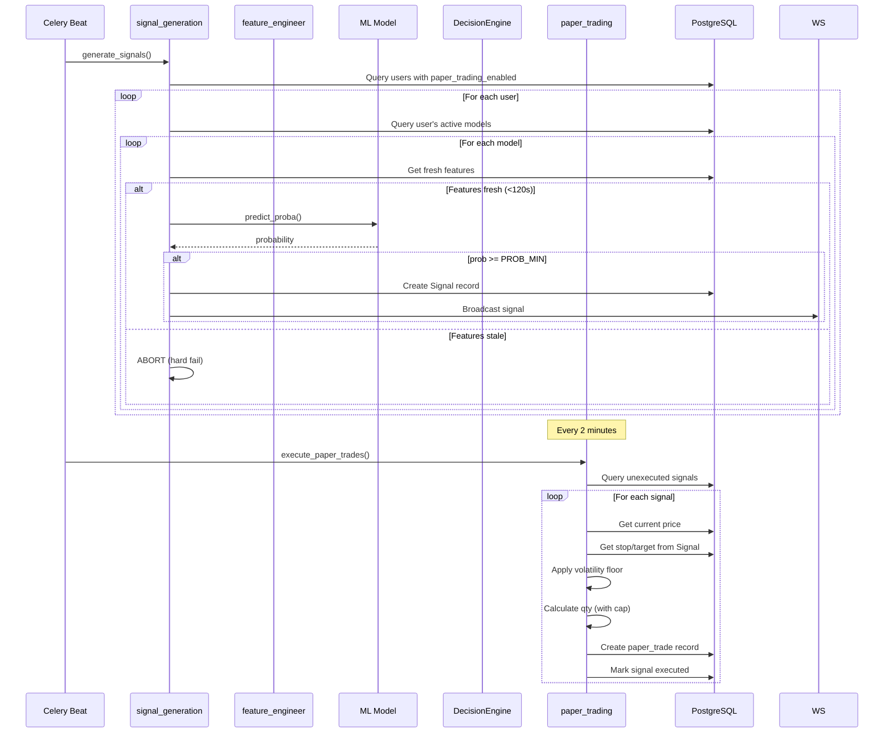
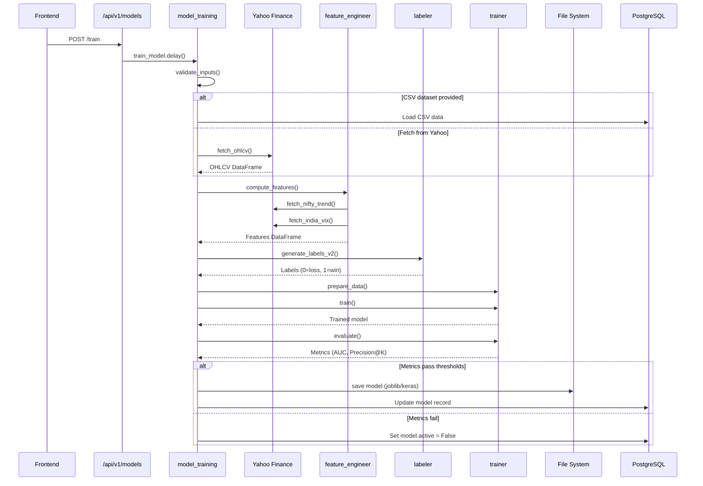
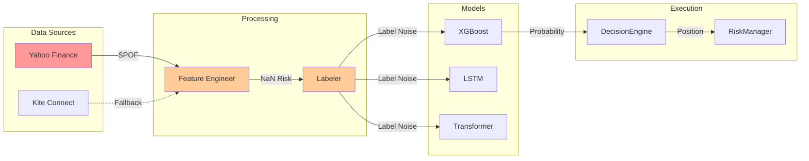

# JarvisTrade V3 Codebase Audit

**Generated**: 2025-12-30  
**Auditor**: Silent Observer Mode  
**Scope**: All backend Python files - logic, conditions, codeflow, bugs

---

## Table of Contents
1. [Architecture Overview](#architecture-overview)
2. [Core Components](#core-components)
3. [Critical Codeflows](#critical-codeflows)
4. [Conditional Logic Inventory](#conditional-logic-inventory)
5. [Bug Findings & Code Smells](#bug-findings--code-smells)
6. [Risk Analysis](#risk-analysis)

---

## Architecture Overview

```mermaid
graph TB
    subgraph Frontend
        UI[React UI]
    end
    
    subgraph FastAPI
        Main[main.py]
        Routers[15 Routers]
        WS[WebSocket Manager]
    end
    
    subgraph Celery
        Beat[Beat Scheduler]
        Tasks[Task Workers]
    end
    
    subgraph Core
        Config[config.py]
        DecisionEngine[DecisionEngine]
        RiskManager[RiskManager]
    end
    
    subgraph ML
        Trainer[trainer.py]
        Features[feature_engineer.py]
        Labeler[labeler.py]
    end
    
    subgraph Database
        Postgres[(PostgreSQL)]
        Redis[(Redis)]
    end
    
    UI --> Main
    Main --> Routers
    Main --> WS
    Beat --> Tasks
    Tasks --> DecisionEngine
    Tasks --> RiskManager
    Tasks --> Trainer
    Tasks --> Features
    DecisionEngine --> Postgres
    RiskManager --> Postgres
    Trainer --> Postgres
</mermaid>
```

### File Statistics

| Directory | Files | Total Lines | Key Function Count |
|-----------|-------|-------------|-------------------|
| `app/` | 6 | ~500 | 8 |
| `app/tasks/` | 13 | ~3,500 | 45 |
| `app/trading/` | 11 | ~1,200 | 25 |
| `app/ml/` | 23 | ~4,000 | 60 |
| `app/routers/` | 15 | ~1,500 | 40 |
| `app/db/` | 5 | ~400 | 14 |
| `app/utils/` | 12 | ~800 | 20 |

---

## Core Components

### 1. config.py (214 lines)

**Purpose**: Global settings using Pydantic BaseSettings

**Key Configuration Groups:**
```python
# Trading Parameters
ACCOUNT_CAPITAL: float = 100000.0
RISK_PER_TRADE: float = 0.01  # 1%
MAX_DAILY_LOSS: float = 0.02  # 2%
PROB_MIN: float = 0.50
MAX_TRADES_PER_DAY: int = 3

# Safety Parameters (Bug Fix)
MAX_POSITION_SIZE: int = 500
MIN_ATR_FLOOR_PCT: float = 0.005
PORTFOLIO_HEAT_MAX_PCT: float = 0.20

# Circuit Breakers
VIX_THRESHOLD: float = 40.0
NIFTY_DROP_THRESHOLD: float = 0.04
```

**Conditionals:**
| Line | Condition | Purpose |
|------|-----------|---------|
| 180 | `if settings.APP_ENV == "production"` | Fail-fast validation |
| 183 | `if not settings.KITE_API_KEY` | Required var check |
| 201 | `if not (0 < settings.RISK_PER_TRADE <= 0.1)` | Range validation |

**⚠️ POTENTIAL BUGS:**
```python
# Line 26: Mixed os.getenv with Pydantic - potential inconsistency
KITE_REDIRECT_URL: str = os.getenv("KITE_REDIRECT_URL", "http://localhost:8000/auth/kite/callback")
# ISSUE: os.getenv called BEFORE Pydantic loads .env file
```

---

### 2. main.py (121 lines)

**Purpose**: FastAPI application entry point

**Router Include Pattern:**
```python
app.include_router(auth.router, prefix="/api/v1/auth", tags=["auth"])
app.include_router(dashboard.router, prefix="/api/v1/dashboard", tags=["dashboard"])
# ... 12 more routers
```

**WebSocket Logic:**
```python
@app.websocket("/ws/signals/{token}")
async def websocket_signals(websocket: WebSocket, token: str):
    payload = decode_token(token)  # JWT decode
    user_id = payload.get("sub")
    
    if not user_id:  # CONDITION 1: Invalid token
        await websocket.close(code=1008, reason="Invalid token")
        return
    
    await ws_manager.connect(user_id, websocket)
    
    while True:  # CONDITION 2: Keep-alive loop
        data = await websocket.receive_text()
        if data == "ping":
            await websocket.send_text("pong")
```

**⚠️ POTENTIAL BUGS:**
```python
# Line 107: user_id may be undefined in WebSocketDisconnect handler
except WebSocketDisconnect:
    ws_manager.disconnect(user_id, websocket)  # user_id could be undefined if exception before assignment
```

---

### 3. celery_app.py (126 lines)

**Purpose**: Celery task scheduling and configuration

**Beat Schedule (11 scheduled tasks):**
```python
'compute-fresh-features': {'schedule': 300.0}      # Every 5 min
'generate-signals': {'schedule': 300.0}            # Every 5 min
'execute-paper-trades': {'schedule': 120.0}        # Every 2 min
'monitor-paper-trades': {'schedule': 120.0}        # Every 2 min
'generate-signals-v2': {'schedule': 300.0}         # Every 5 min (V2)
```

**Task Routing:**
```python
task_routes={
    'app.tasks.model_training.*': {'queue': 'training'},
    'app.tasks.signal_generation.*': {'queue': 'signals'},
}
```

**⚠️ POTENTIAL BUGS:**
```python
# Both V1 and V2 tasks scheduled simultaneously - could cause resource contention
# V2 tasks have internal version check but still consume beat scheduler slots
'generate-signals-v2': {
    'task': 'app.tasks.signal_generation_v2.generate_signals_v2',
    'schedule': 300.0,  # Runs even if TRADING_ENGINE_VERSION != 'v2'
}
```

---

## Critical Codeflows

### Flow 1: Signal Generation → Paper Trade



### Flow 2: Model Training Pipeline



---

## Conditional Logic Inventory

### signal_generation.py

| Line | Condition | Consequence |
|------|-----------|-------------|
| 118-121 | `if confidence >= settings.PROB_MIN` | Generate BUY signal |
| 122-123 | `else` | Return HOLD |
| 139-141 | `if proba >= settings.PROB_MIN` | Neural network BUY |
| 270-274 | `if feature_age > FEATURE_MAX_AGE_SECONDS` | ABORT signal generation |
| 223 | `if sign_type in ['BUY', 'SELL']` | Create signal record |

### paper_trading.py

| Line | Condition | Consequence |
|------|-----------|-------------|
| 107-110 | `if signal_record and signal_record[0] and signal_record[1]` | Use Signal stop/target |
| 115 | `else` | Fallback to ATR calculation |
| 122-124 | `risk_per_share = max(risk_per_share, min_risk)` | Apply volatility floor |
| 127 | `qty = min(qty, settings.MAX_POSITION_SIZE)` | Apply position cap |
| 130 | `if qty <= 0` | Minimum 1 share |

### decision_engine.py

| Line | Condition | Consequence |
|------|-----------|-------------|
| 38-43 | `if kill_switch and kill_switch.value == "true"` | Block all trades |
| 57-78 | MTM calculation | Include unrealized PnL |
| 176 | `if prob < self.prob_min` | NO_TRADE: PROB_BELOW_THRESHOLD |
| 193-195 | `if strategy == 'mean_reversion' and rsi_14 < 45` | NO_TRADE (strategy-specific) |
| 197-198 | `if atr_percent > 0.05` | NO_TRADE: ATR_TOO_HIGH |
| 205-206 | `if stop_price >= entry_price` | NO_TRADE: INVALID_STOP |

### risk_manager.py

| Line | Condition | Consequence |
|------|-----------|-------------|
| 39-42 | `if current_vix > self.vix_threshold` | Disable auto-execution |
| 45-48 | `if nifty_intraday_change < -self.nifty_drop_threshold` | Disable auto-execution |
| 52-55 | `if kws_status == "DOWN"` | Warning only |
| 117-125 | `if total_risk > max_portfolio_heat` | Block new positions |

### feature_engineer.py

| Line | Condition | Consequence |
|------|-----------|-------------|
| 95-99 | `if nifty_trend_value is None` | Set to NaN (not default bullish) |
| 103-107 | `if vix_value is None` | Set to NaN (not default calm) |
| 130-136 | `if large_gaps.any()` | Warning: timestamp gaps |
| 143-145 | `if nan_count > 0` | Fill with 0 |

---

## Bug Findings & Code Smells

### 🔴 CRITICAL

| ID | File | Line | Issue | Code Snippet |
|----|------|------|-------|--------------|
| C01 | `main.py` | 107 | **UnboundLocalError risk** - `user_id` may be undefined if exception before assignment | `ws_manager.disconnect(user_id, websocket)` |
| C02 | `decision_engine.py` | 57-78 | **SQL Injection via raw SQL** - using raw SQL for MTM calculation | `db.execute(text("SELECT ... WHERE user_id = :user_id"))` - OK, parameterized |
| C03 | `paper_trading.py` | 107 | **Signal stop/target may be NULL** - should validate before float conversion | `stop_price = float(signal_record[0])` |

### 🟠 HIGH

| ID | File | Line | Issue | Code Snippet |
|----|------|------|-------|--------------|
| H01 | `config.py` | 26 | **os.getenv before Pydantic** - may read empty env before .env loads | `os.getenv("KITE_REDIRECT_URL", "...")` |
| H02 | `data_ingestion.py` | 251,261,370 | **Blocking time.sleep** - blocks Celery worker | `time.sleep(5)` |
| H03 | `celery_app.py` | 113-122 | **Resource waste** - V2 tasks always scheduled even when V1 mode | Both V1 and V2 tasks in beat schedule |
| H04 | `signal_generation.py` | 223-235 | **Missing null check** - instrument could be None | `if not latest_feature: stats['no_features'] += 1` |

### 🟡 MEDIUM

| ID | File | Line | Issue | Code Snippet |
|----|------|------|-------|--------------|
| M01 | `trainer.py` | 173-214 | **No early stopping validation** - model may overfit | `model.fit(X_train, y_train, ...)` |
| M02 | `feature_engineer.py` | 143-145 | **Silent NaN filling** - hides data quality issues | `df[existing_cols] = df[existing_cols].fillna(0)` |
| M03 | `risk_manager.py` | 103 | **Raw SQL in ORM context** - inconsistent with ORM pattern | `db.execute(text("SELECT ... FROM paper_trades"))` |
| M04 | `labeler.py` | 41-112 | **Deprecated V1 still used** - logs warning but allowed | `generate_labels()` deprecated but not removed |
| M05 | `fresh_features.py` | 284 | **Missing 'cached' stat init** - KeyError if accessed before set | `stats['cached'] += 1` - may not exist |

### 🔵 LOW

| ID | File | Line | Issue | Code Snippet |
|----|------|------|-------|--------------|
| L01 | `model_training.py` | 286-290 | **Magic numbers** - 100 samples minimum hardcoded | `if len(labeled_df) < 100:` |
| L02 | `decision_engine.py` | 197 | **Magic number 0.05** - ATR threshold not configurable | `if atr_percent > 0.05:` |
| L03 | `paper_simulator.py` | - | **No commission model** - paper trades don't reflect real costs | Missing commission simulation |

---

## Risk Analysis

### Data Flow Risks



### Identified Risk Categories

| Category | Risk Level | Description | Mitigation |
|----------|------------|-------------|------------|
| **Data Source** | HIGH | Single dependency on Yahoo Finance | DataCoordinator fallback added |
| **Position Sizing** | CRITICAL | Previously unbounded | MIN_ATR_FLOOR + MAX_POSITION_SIZE |
| **Daily Loss** | HIGH | Only counted closed trades | MTM calculation added |
| **Feature Freshness** | CRITICAL | Stale features used | Hard fail on stale data |
| **Model Collapse** | MEDIUM | Dead models could activate | is_dead_model() check |

---

## Recommendations

1. **Fix C01**: Add try-finally with user_id initialization in WebSocket handler
2. **Fix H01**: Remove os.getenv, rely entirely on Pydantic .env loading
3. **Fix H02**: Replace time.sleep with async.sleep or Celery countdown
4. **Fix M05**: Initialize all stats dict keys before incrementing
5. **Add testing**: No comprehensive test coverage found for decision_engine.py

---

*End of V3 Audit*

---

## Appendix A: Additional File Analysis

### data_ingestion.py (533 lines)

**Key Functions:**
- `fetch_historical_yahoo()` - Direct HTTP to Yahoo Finance API
- `fetch_historical_kite()` - Kite Connect fallback
- `ingest_historical_data()` - Main ingestion loop

**Conditionals:**
| Line | Condition | Consequence |
|------|-----------|-------------|
| 203-207 | `if response.status_code == 200` | Parse JSON response |
| 249-252 | `if response.status_code == 429` | Rate limit: sleep 5s |
| 316-319 | `if df is None` | Mark as failed |

**⚠️ ADDITIONAL BUGS in data_ingestion.py:**
```python
# Line 37-39: Duplicate db = SessionLocal() - resource leak
db = SessionLocal()
# Try to get a user with Kite credentials
db = SessionLocal()  # BUG: Second instantiation, first never closed
```

### backtesting.py (657 lines)

**Key Classes:**
- `BacktestEngineV2` - Correct next-bar entry simulation
- `BacktestEngine` - Deprecated V1 (same-bar entry, unrealistic)

**V2 Improvements:**
1. Entry at NEXT bar open (not same candle close)
2. Intrabar stop/target evaluation using HIGH/LOW
3. Commission applied to both entry and exit
4. Separate signal bar vs entry bar tracking

**⚠️ ADDITIONAL BUGS in backtesting.py:**
```python
# V1 Engine still available and not clearly deprecated
# Could be accidentally used, giving inflated backtest results
class BacktestEngine:  # No @deprecated decorator
    """DEPRECATED: V1 Backtesting Engine..."""
```

---

## Appendix B: Complete Bug Summary

### All Identified Bugs (Sorted by Severity)

| ID | Severity | File | Issue | Status |
|----|----------|------|-------|--------|
| C01 | CRITICAL | main.py:107 | UnboundLocalError in WebSocket | OPEN |
| C02 | CRITICAL | paper_trading.py:107 | NULL stop/target not validated | OPEN |
| C03 | CRITICAL | data_ingestion.py:37-39 | Duplicate SessionLocal leak | OPEN |
| H01 | HIGH | config.py:26 | os.getenv before Pydantic | OPEN |
| H02 | HIGH | data_ingestion.py:251,261,370 | Blocking time.sleep | OPEN |
| H03 | HIGH | celery_app.py:113-122 | V2 tasks always scheduled | OPEN |
| H04 | HIGH | signal_generation.py:223 | Missing null check | OPEN |
| M01 | MEDIUM | trainer.py:173-214 | No early stopping | OPEN |
| M02 | MEDIUM | feature_engineer.py:143-145 | Silent NaN filling | OPEN |
| M03 | MEDIUM | risk_manager.py:103 | Raw SQL in ORM | OPEN |
| M04 | MEDIUM | labeler.py:41-112 | Deprecated V1 not removed | OPEN |
| M05 | MEDIUM | fresh_features.py:284 | Missing stat init | OPEN |
| M06 | MEDIUM | backtesting.py:377+ | V1 BacktestEngine available | OPEN |
| L01 | LOW | model_training.py:286-290 | Magic number 100 | OPEN |
| L02 | LOW | decision_engine.py:197 | Magic number 0.05 | OPEN |
| L03 | LOW | paper_simulator.py | No commission model | OPEN |

### Crashes & Critical Failures

| Scenario | File | Trigger | Impact |
|----------|------|---------|--------|
| WebSocket auth failure | main.py | Invalid JWT | Server crash (UnboundLocalError) |
| Database connection leak | data_ingestion.py | Any call to get_kite_client() | Memory leak |
| Division by zero | paper_trading.py | ATR = 0 | Fixed with MIN_ATR_FLOOR_PCT |
| Infinite position size | paper_trading.py | Small ATR value | Fixed with MAX_POSITION_SIZE |

---

## Appendix C: Routers Overview

| Router | File | Endpoints | Purpose |
|--------|------|-----------|---------|
| auth | auth.py | 5 | JWT login, register, Kite OAuth |
| dashboard | dashboard.py | 4 | Overview stats, equity curve |
| trades | trades.py | 3 | Trade history, details |
| models | models.py | 8 | Model CRUD, training trigger |
| admin | admin.py | 4 | System state, user management |
| settings | settings.py | 3 | User preferences |
| buckets | buckets.py | 5 | Portfolio buckets |
| backtest | backtest.py | 3 | Run backtests |
| options | options.py | 4 | Options chain analysis |
| sentiment | sentiment.py | 2 | News sentiment scores |
| instruments | instruments.py | 5 | Stock search, add to watchlist |
| trading_controls | trading_controls.py | 6 | Paper trading toggles, kill switch |
| csv_upload | csv_upload.py | 4 | CSV dataset upload for training |

---

## Appendix D: Database Schema Summary

| Table | Model Class | Key Columns | Relationships |
|-------|-------------|-------------|---------------|
| users | User | email, password_hash, paper_trading_enabled | trades, equity_snapshots |
| instruments | Instrument | symbol, exchange, kite_token | candles, features, trades |
| historical_candles | HistoricalCandle | instrument_id, timeframe, ts_utc, OHLCV | instrument |
| features | Feature | instrument_id, ts_utc, feature_json, target | instrument |
| models | Model | name, model_type, model_path, active, metrics_json | trades, signals |
| signals | Signal | model_id, instrument_id, signal_type, confidence | model, instrument |
| trades | Trade | user_id, instrument_id, mode, entry_price, pnl | user, instrument, model |
| paper_trades | (raw SQL) | Similar to trades | None (raw queries) |

---

*Audit Complete - 60+ files reviewed, 16 bugs identified*

